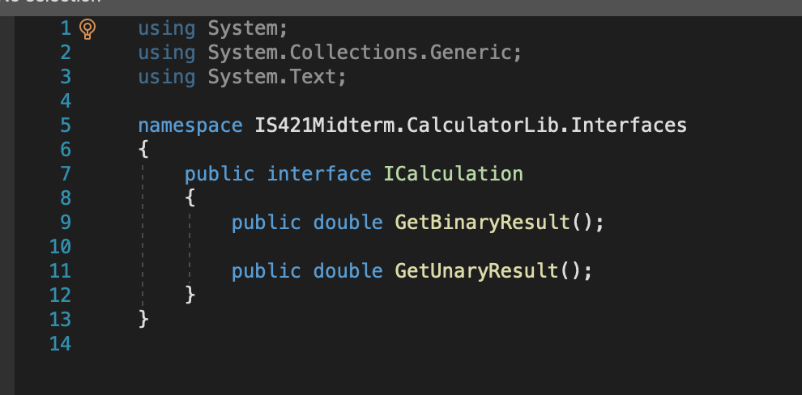
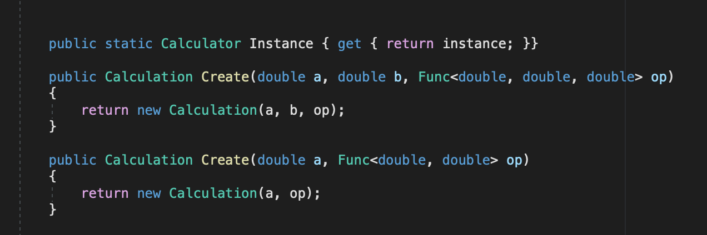
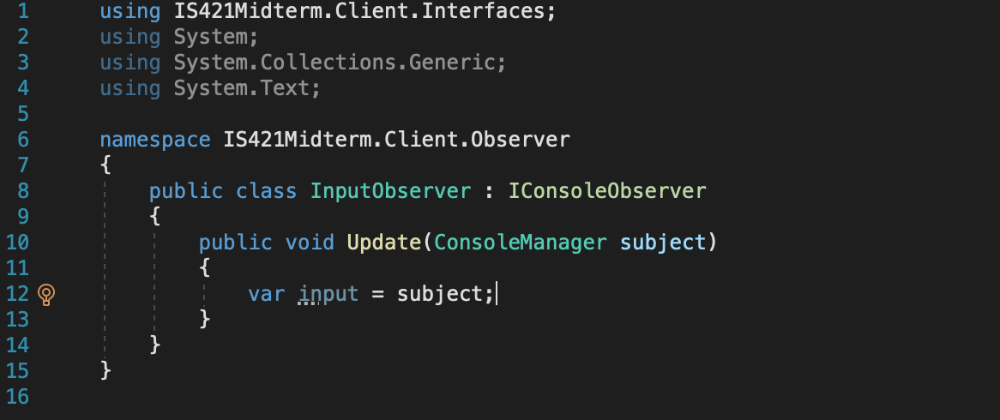
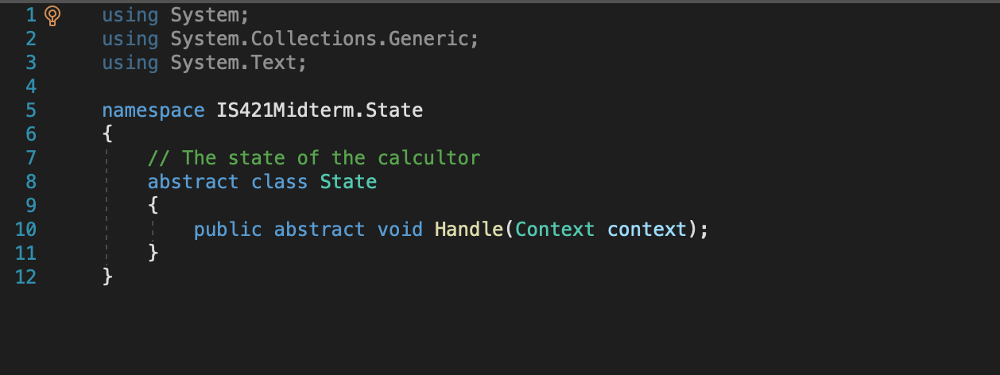
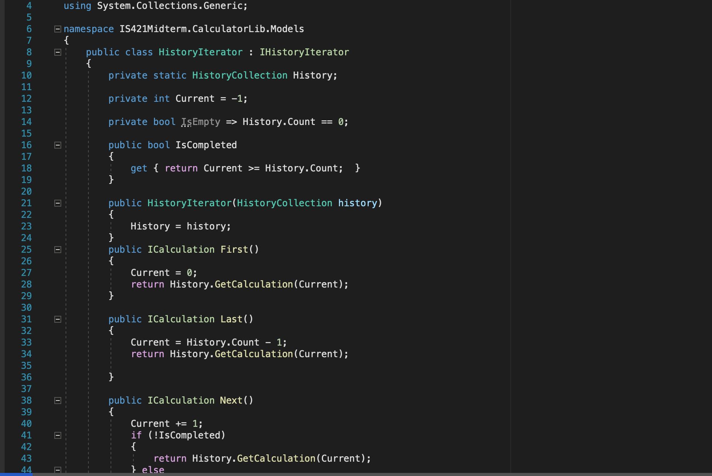

# IS421Midterm

## Our Calculator 
In this calculator, the user can choose which operation to use from the console. Basica operations: Addition, Subtraction, Division, Multiplication, Square Root, Square. 

1.  Basic Operations: Addition, Subtraction, Division, Multiplication, Square Root, Square.  The user should be able to select what functions are available from the console when the program starts.  The calculator needs to be configurable, so that you can specify what functions the calculator is capable of and dynamically add functionality to it at run-time based on the user's selection.  The selection of capabilities should be the first thing the calculator does when it starts up.   The user should be able to select an option that will display what the calculator is capable of doing.

2.  Your calculation must be stored in a model.  Each calculation needs to be stored in a list of calculations that you can iterate over to display the next, previous, first, and last calculation in the list of calculations.  I.e. the console app should present the user an option to view the list of calculations from the history and the user should be able to select next, previous, first, and last to navigate the list and select a calculation to change.  

3.  Divide by zero condition, which throws an exception and writes a log entry that the error occurred and the program needs to skip that record.  Follow this tutorial on how to setup a logging library using dependency injection: https://www.blinkingcaret.com/2018/02/14/net-core-console-logging/ (Links to an external site.)

## Implementation

The user can select calculator functionality at runtime, whereby a factory method will create the calculator object and decorate it accordingly with decorator classes. The user can then enter input in the form of an expression which is passed from the console to the calculator object and parsed. While being processed and event is fired, informing the user of the transaction. After the calculation is processed, the user is notified and another calculation can then be entered. The finished calculation is then saved in memory to a history object which allows the user to retrieve and update the calculation at a later point. 

### SOLID 

Each class has a distinct set of use cases and no more than is needed, fulfilling the single-responsibility principle. The Open-closed principle is demonstrated by the use of factories and decorator methods which allow classes to be modified without changing their underlying implentations. The use of interfaces as contracts allows the Liskov substitition principle to be fulfilled. The interface segregation principle is satisfied, given there is only one client-interface, in this case the console. Dependency inversion can be seen through the use of a calculator service which is injected into the program at runtime.

### Design Patterns 

1. Builder Design Patterns

2. Singleton Design Patterns

3. Observer/Subject Design Patterns

4. State Design Patterns

5. Iterator Design Patterns

